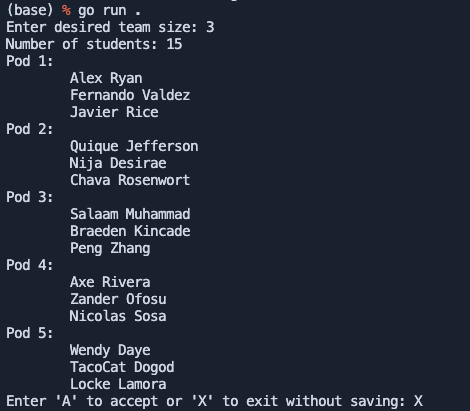

# Team Maker 3000

Team Maker 3000 is a Go application that assigns students to different pods based on user-defined team sizes. This application is useful for organizing students into groups (or pods) for projects, discussions, or activities, while also ensuring minimal repeat collaborations.


## Getting Started

### Prerequisites

- Go 1.18 or higher installed on your machine.
- Git installed on your machine.
- PostgreSQL installed and running.

### Installation

1. Clone the repository:

   ```sh
   git clone https://github.com/materdev/teammaker3000.git
   cd teammaker3000
   ```

2. Initialize the Go module:

   ```sh
   go mod tidy
   ```

### Setting Up PostgreSQL Database

1. **Install PostgreSQL**: Follow the instructions for your operating system to install PostgreSQL.

2. **Create Database**: Create a new database named `teammaker3000`:

   ```sh
   psql -U postgres
   CREATE DATABASE teammaker3000;
   \c teammaker3000;
   ```

3. **Create Tables**: Run the following SQL commands to create the required tables:

   ```sql
   CREATE TABLE students (
       id SERIAL PRIMARY KEY,
       name VARCHAR(255) UNIQUE NOT NULL
   );

   CREATE TABLE collaborations (
       id SERIAL PRIMARY KEY,
       student1_id INTEGER NOT NULL REFERENCES students(id),
       student2_id INTEGER NOT NULL REFERENCES students(id),
       collaborations_count INTEGER DEFAULT 1,
       UNIQUE(student1_id, student2_id)
   );
   ```

### Running the Application

To run the application, execute the following command in the project root directory:

```sh
go run .
```

### Using the Application

1. **Enter Team Size**: When prompted, enter the desired team size. The application will ensure no team has only one person.
2. **Review Teams**: The application will display the generated teams.
3. **Confirm Teams**: You can either accept the teams, reroll to generate new teams, or exit without saving.

### Application Details

The application performs the following tasks:

1. **Read Student Names**:
   - The application reads a list of student names from the `data` package.

2. **Create Students**:
   - It creates student instances from the list of names.

3. **Assign Pods**:
   - The application assigns students to pods based on the desired team size, ensuring minimal repeat collaborations.

4. **Display Pods**:
   - It displays the number of students and lists the students in each pod.

5. **Save Collaborations**:
   - Upon user confirmation, the application saves the collaboration data to the PostgreSQL database.

### Example Output



<!-- Hideable code block -->
<details>
<summary>Click to expand the example output text</summary>

```sh
Number of students: 15
Pod 1:
    Alex Ryan
    Quique Jefferson
    Salaam Muhammad
    Axe Rivera
Pod 2:
    Fernando Valdez
    Nija Desirae
    Braeden Kincade
    Zander Ofosu
Pod 3:
    Javier Rice
    Chava Rosenwort
    Peng Zhang
    Wendy Daye
Pod 4:
    Nicolas Sosa
    TacoCat Dogod
    Locke Lamora
```
</details>

## License

This project is licensed under the MDGUL License - see the [LICENSE](LICENSE) file for details.
```

This README includes instructions to set up the PostgreSQL database, run the application, and details about the application's functionality.